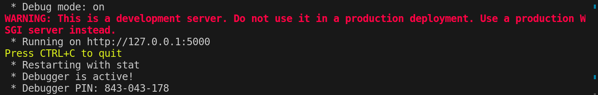

## Como instalar

1. instale o python na sua maquina (https://www.youtube.com/watch?v=qxyfsNu7XN0)
2. após instalar o python, instale suas dependencias com `pip install -r requirements.txt`

## Como rodar o servidor

3. rode o servidor usando `python3 src/server.py`
4. O servidor vai rodar no seu localhost:5000
Exemplo:

5. envie uma request para localhost:5000/SelfResearchAPI/ibge/pesquisa

Exemplo: 